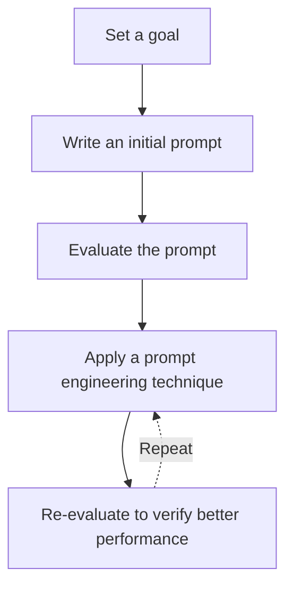
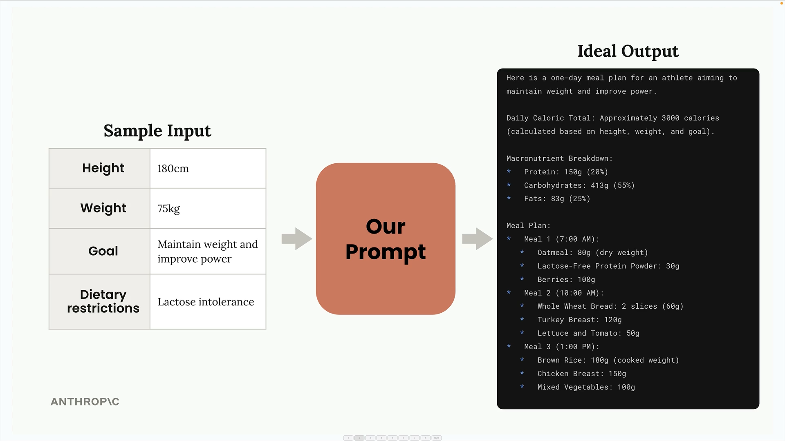

# 3. Prompt Engineering

Relevant Notebooks:
- [001_prompting.ipynb](./notebooks/3-prompt-engineering/001_prompting.ipynb)
- [002_exercise.ipynb](./notebooks/3-prompt-engineering/002_exercise.ipynb)

Improving our prompt to get a more reliable & higher quality outputs.

## Prompt Engineering Iterative Process



## Our Goal

Write a prompt that generates a 1-day meal plan for an athlete based on their height, weight, goal and dietary restrictions.



### Initial Prompt:

```markdown
What should this person eat?
    - Height: ...
    - Weight: ...
    - Goal: ...
    - Dietary restrictions: ...
```

**Eval Score:** 3/10

## Prompt Engineering Techniques

### Clear & Direct

- Use simple language
- State what you want explicitly
- Lead with an action verb of the model's task
- Use instructions, not questions

```markdown
Generate a one-day meal plan for an athlete that meets their dietary restrictions.
    - Height: ...
    - Weight: ...
    - Goal: ...
    - Dietary restrictions: ...
```

**Eval Score:** 7.33/10

### Be Specific

#### Guidelines: Qualities/ attributes that we want in the output. 

```markdown
Generate a one-day meal plan for an athlete that meets their dietary restrictions.
  - Height: ...
  - Weight: ...
  - Goal: ...
  - Dietary restrictions: ...

Guidelines:
  1. Include accurate daily calorie amount
  2. Show protein, fat and carb amounts
  3. Specify when to eat each meal
  4. Use only foods that fit restrictions
  5. List all portion sizes in grams
  6. Keep budget-friendly if mentioned
```

**Eval Score:** 10/10

This prompt is working very well for this small eval dataset, but it could potentially not work as well for different conditions.
  
#### Steps that the model should follow to arrive to the final output.

  ```markdown
  Generate a one-day meal plan for an athlete that meets their dietary restrictions.
    - Height: ...
    - Weight: ...
    - Goal: ...
    - Dietary restrictions: ...

  Follow the steps:
    1. Calculate daily calories needed
    2. Figure out protein, fat, carb amounts
    3. Plan meal timing around workouts
    4. Choose foods that fit restrictions
    5. Set portion sizes in grams
    6. Adjust budget if needed
  ```

  **Eval Score:** 9.67/10

#### When to provide steps:


### Structure with XML Tags

When building very large prompts that include a lot of content, Claude can struggle to understand the different sections. XML tags provide a simple way to add structure and clarity to prompts especially when interpolating large amounts of data.


```markdown
Generate a one-day meal plan for an athlete that meets their dietary restrictions.

<athlete_information>
  - Height: ...
  - Weight: ...
  - Goal: ...
  - Dietary restrictions: ...
</athlete_information>

Follow the steps:
  1. Calculate daily calories needed
  2. Figure out protein, fat, carb amounts
  3. Plan meal timing around workouts
  4. Choose foods that fit restrictions
  5. Set portion sizes in grams
  6. Adjust budget if needed
```

**Eval Score:** 10/10

#### When to Use XML Tags

When the prompt contains:
- large amounts of context or data
- multiple distinct types of data
- boundaries between different scenarios
- content that might be confusing with instructions

### One-Shot/ Multi-Shot Prompting

Useful for:
- capturing corner cases
- defining complex output formats (lik specific JSON structures)
- showing Claude what "good" outputs look like

It's highly recommended combining this technique & adding XML tags for structure.


Providing examples is **especially effective when doing prompt evals**. We can find a test case with a high score and we can add that as an example inside the prompt. 

```markdown
Generate a one-day meal plan for an athlete that meets their dietary restrictions.

<athlete_information>
  - Height: ...
  - Weight: ...
  - Goal: ...
  - Dietary restrictions: ...
</athlete_information>

Follow the steps:
  1. Calculate daily calories needed
  2. Figure out protein, fat, carb amounts
  3. Plan meal timing around workouts
  4. Choose foods that fit restrictions
  5. Set portion sizes in grams
  6. Adjust budget if needed

Here is an example with a sample input and an ideal output:

<sample_input>
height: 178
weight: 75
goal: Build muscle mass through crossfit training while following a whole-food vegan diet
restrictions: Vegan, no processed foods, no supplements
<sample_input>

<ideal_output>
I'll help create a meal plan following those steps.

1. Daily Calorie Calculation:
- Basal metabolic rate (BMR) ≈ 1,725 calories
- With high activity + muscle building goal ≈ 2,800 calories needed

...

This plan provides complete proteins through combinations of legumes, grains, and seeds, while maintaining whole-food vegan requirements. All portions can be adjusted based on individual needs and response to training.
</ideal_output>

The example solution fully satisfies all mandatory requirements with detailed caloric total (2800), complete macro breakdown, and precise meal timing/portions. It adheres strictly to whole-food vegan guidelines with no processed items.
```

**Eval Score:** 10/10

#### Best Practices

- Use XML tags to clearly structure your examples
- Be explicit about what you're showing Claude
- Choose representative examples that cover your most important use cases
- Include corner cases that might trip up the model
- Explain why examples are good when it's not obvious
