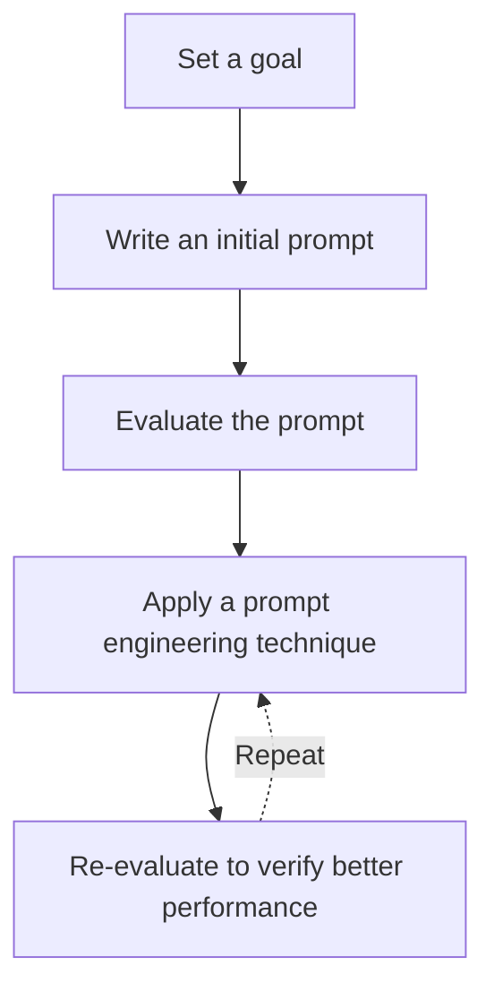

# 3. Prompt Engineering

Relevant Notebooks:
- [001_prompting.ipynb](./notebooks/3-prompt-engineering/001_prompting.ipynb)

Improving our prompt to get a more reliable & higher quality outputs.

## Prompt Engineering Iterative Process

## Our Goal

Write a prompt that generates a 1-day meal plan for an athlete based on their height, weight, goal and dietary restrictions.

