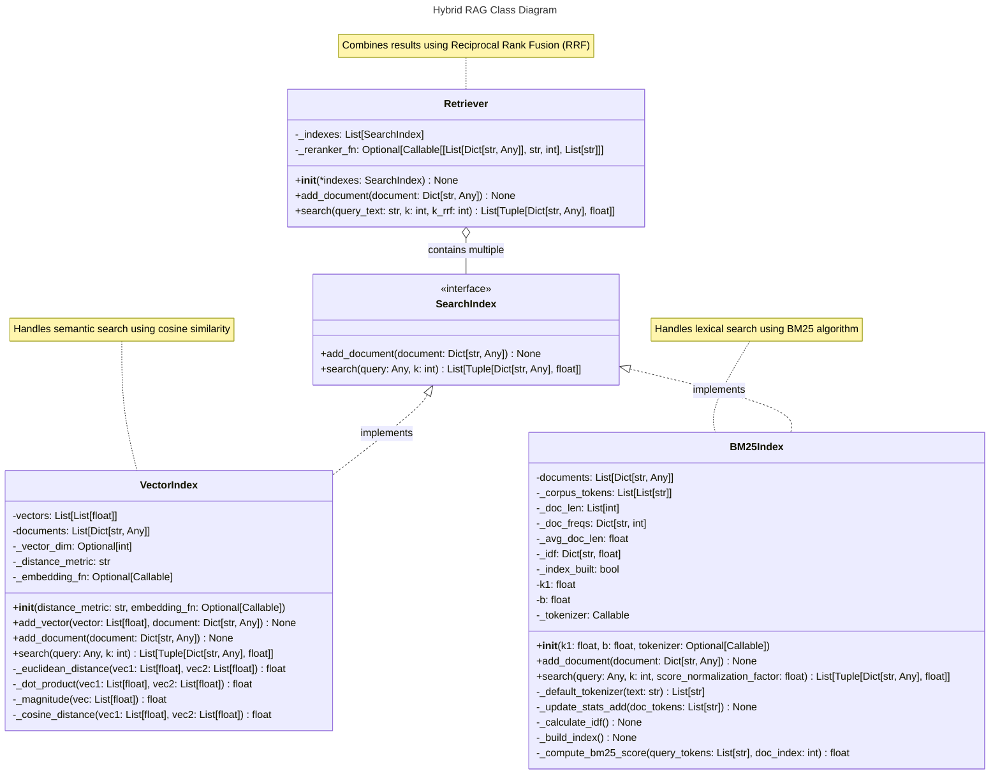

# 5. Retrieval Augmented Generation (RAG)

RAG is a technique which is useful when we want to retrieve/ extract relevant sections of large documents to answering specific questions. 

Jupyter Notebooks:
1. [001_chunking.ipynb](./notebooks/5-rag/001_chunking.ipynb)
2. [002_embeddings.ipynb](./notebooks/5-rag/002_embeddings.ipynb)
3. [003_vectordb.ipynb](./notebooks/5-rag/003_vectordb.ipynb)
4. [004_bm25.ipynb](./notebooks/5-rag/004_bm25.ipynb)
5. [005_hybrid.ipynb](./notebooks/5-rag/005_hybrid.ipynb)
6. [006_reranking.ipynb](./notebooks/5-rag/006_reranking.ipynb)
7. [007_contextual.ipynb](./notebooks/5-rag/007_contextual.ipynb)

## Option 1: Include The Entire Doc Into The Prompt 

This is not a good approach because:
1. There's a hard limit on how much text can be fed into Claude 
2. Claude get's less effective as prompts gets longer
3. Performance degrades when there's too much information
4. Long prompt = more $$$
5. Long prompt = more time to process

## Option 2: Include Relevant Chunks Into The Prompt

In this approach we:
1. Split the document into smaller **chunks**.
   - Chunking could be based on equal portions or relevant headers/ sections or by semantic meaning or other strategies.
2. When the user asks a question, find the most relevant chunk.
3. Include the relevant chunk in the prompt to Claude.


## Benefits of RAG

- Claude only focuses on the most relevant content and tunes out irrelevant content.
- Scales to very large documents and multiple documents.
- Smaller prompts = lower costs & faster processing.

## Challenges with RAG

- Requires preprocessing steps to chunk documents.
- Needs a mechanism to find relevant chunks (retrieval).
- Retrieved chunks may not have all the necessary context.
- Some chunking approach may work better in some cases, while others may work better for other cases. 

## When To Use RAG

- While working with large documents - usually beyond what can fit into a single prompt.
- When technical implementation of chunking, search & retrieval makes sense for the application.

## Text Chunking Strategies

This is one of the **most critical** steps in the RAG pipeline. 

We can divide text based on:
1. Size: divide the text into strings of equal length 
2. Structure: divide based on document structure (like headers, paragraphs, sections) 
3. Semantic Meaning: group related sections using NLP

### Size Based Chunking

- Easiest technique. 
- Most often used in production.

#### Downsides

- Each chunk has a cutoff text
- Each chunk lacks context

#### Workaround

Add an overlap with neighboring chunks to solve the above two problems, however, this causes duplication of text.

### Structure Based Chunking

We can programmatically split chunks based on headers such as the ones in a Markdown (MD) file. This works well for MD files but in reality most documents may not be formatted in MD.

Implementation can be challenging in plain text files or inconsistently formatted documents.

### Semantic Based Chunking

Here we divide text into groups of related sentences or sections. This would require us to use NLP techniques to understand the meaning of individual sentences so that similar ones can be placed in the same group. This is computationally expensive but can retrieve more relevant chunks.

### Choosing the Right Strategy

Chunking strategy is solely based on the use case:

- **character based:** Most reliable fallback & works with any document type.
- **sentence based:** Good balance of context and meaning for the prose.
- **section based:** excellent results when you have consistent structure in documents.

## Semantic Search Using Text Embeddings

Once we have chunks of text, the next step in the RAG pipeline is to determine which chunks are related to a user query. We can't just do keyword based search, we need to understand both the meaning & context of the question and the chunks. In other words, we need to do semantic search using text embeddings.

### Text Embeddings

These are numeric representations of the meaning contained in the text. The text is converted into vectors (list of numbers ranging from -1 to 1). 


Each of these numbers represent a score for some quality or metric of the input. For example: 
- how "happy" the text is
- how much the text talks about "movies"
- how much the text talks about "games"
- ...

We don't know exactly what each number denotes but the above examples state the idea of how each number can tell models about what information they contain.

#### Why Embeddings Matter for RAG

Embeddings are very useful because similar texts will have similar embedding values. This way we can mathematically compare a user's question to the chunks & find semantically similar ones - even if they are not worded the same way.

## RAG Flow

1. Chunk the source text
2. Generate embeddings & perform normalization
3. Store in a vector database
4. Process the user's query with the same embedding & normalization steps
5. Find closest (most similar) embedding(s) to the user's query from the vector database using Cosine Similarity
6. Build the final prompt with user's question & retrieved chunks.

### Cosine Similarity


```math
\cos(\theta) = \frac{A \cdot B}{||A|| \cdot ||B||}
``` 

#### Cosine Distance

```
cosine distance = 1 - cosine similarity
```

Values closer to 0 mean high similarity and larger values mean less similarity.

### Problem With Just Semantic Search

Sometimes there are corner cases, where semantic search doesn't perform well. For instance, when we want to search for specific keywords.


This is because semantic search focuses on the meaning rather than the exact word.

### Hybrid Search Strategy


#### Lexical Search with BM25

**BM25 = Best Match 25**

There are many methods for implementing text search, but BM25 is commonly used in RAG pipelines.


This prioritizes `INC-2023-Q4-011` which is a very rare term in our report.

### Hybrid Search

The process is as follows:
1. Run your hybrid search (semantic search + BM25)
2. Merge the results
3. Pass the merged results to a re-ranker function
4. The re-ranker sends everything to Claude with a specific prompt
5. Claude returns a reordered list of the most relevant documents





The LLM re-ranker increases latency but can significantly improve search accuracy by leveraging Claude's understanding of context & relevance.

### Contextual Retrieval

In the RAG pipeline, while performing the chunking, each chunk is independent from one another. However, sometimes, we need the chunks to have a relative understanding of the entire document. 

Contextual retrieval helps solve this problem. At the time we chunk the text, we ask Claude to add context to each chunk based on the entire document (or some parts of the document). This pre-processing step helps Claude better retrieve context & helps it situate where it can get the required information.

For each chunk, the prompt looks like the following:
```
Write a short and succinct snippet of text to situate this chunk within the 
overall source document for the purposes of improving search retrieval of the chunk.

Here is the original source document:
<document>
{source_text}
</document>

Here is the chunk we want to situate within the whole document:
<chunk>
{text_chunk}
</chunk>

Answer only with the succinct context and nothing else.
```

#### When Source Doc Is Too Long

If the source document is too long to fit into the prompt for each chunk, we can take the first few (usually introductions or abstract) and the immediate last few chunks as source text:


Through contextual retrieval, the retriever understands not just whats there in each chunk, but how that information fits into the larger understanding of the entire document & how it relates to other sections.